# 前言:
這次被找來出題滿意外的w，其實一開始是因為台中高工有跟他們科主任討論過想來搞一個實體交流賽，剛剛好北電這邊有機會，結果就被找來了＠＠。

基本上我是負責降低難度的w（~~對我知道有人要說discord 0x1~~），反正希望各位有在這次比賽學習到很多新技術！也恭喜獲獎的大家～

# Writeup
## welcome
### welcome 0x1:
- tag: `THJCC{5cINt_s (1/2)`

> 歡迎來到 THJCC CTF !
> 
> 本次競賽所有Flag格式為 THJCC{*.}
> 
> 記得要詳閱[規則](https://ctf.scint.org/rule) 不要作弊!
> 
> 祝各位榮獲佳績!ヽ(́◕◞౪◟◕‵)ノ
> 
> `Author : OsGa`

welcome 題就是講求一個簡單！

在下方的tag就會看到 part1

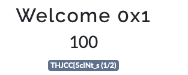

part2 的部分在 rule page 最下方(叫你好好看規則la)

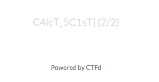

---
### discord 0x1

>相信你已經加入 Discord 伺服器了!
>
> 如果還沒 https://discord.gg/RDhf7rxz4f 趕快加入 領取身份組 !!
>
> 我已經把這題的Flag藏在伺服器裡了 快去尋找吧!
>
> `備註:題目與ticket無關`
> 
> `Author : OsGa`

來到飽受爭議的Discord 0x1

我真的沒想過這題會殺到那麼多人QQ 對不起社會大眾Orz

反正FLAG都在機器人上，看一下機器人就會看到 part1 and part2

part1 在 banner ，part3 在 role

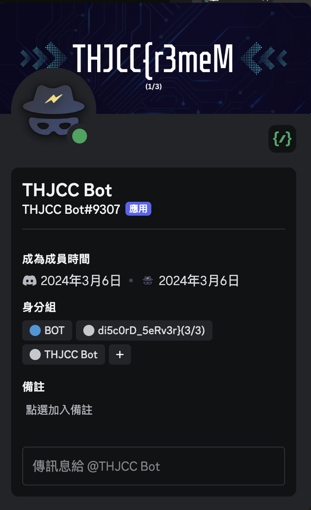

好！那大家找不到的 part2 在哪呢？

如果你在隨便一個文字頻道或私訊他，打上 `/` 去看指令的話，會發現有些 command 很眼熟。

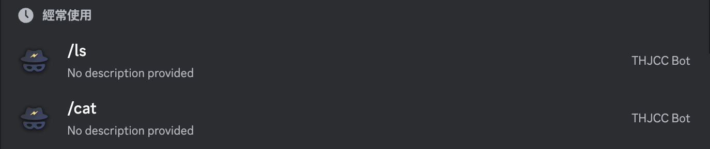

打上 `/ls`

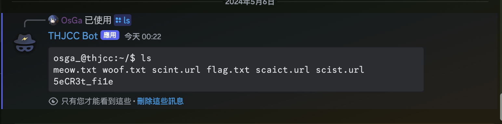

SUS `flag.txt` ，用 `cat` 看看！

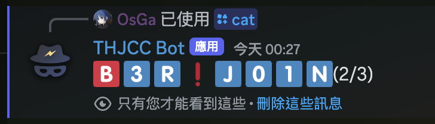

> 然後我藏了一些彩蛋，沒試過的現在可以去試試w

## Crypto
### 博元婦產科
-  tag: `baby`
> 你好,我是博元妇产科蔡医师,近期我们正计画打造一批超强资安人才菁英,结果发生意外,这群小鬼居然绑架我,还差5000元就能逃离出他们魔掌 ,但我的银行号码被他们给加密了,这是加密后的银行号码`TUFDVlZ7cFBwLnU0VXJmVGQzay52MEYubVB9Cg==` ,你现在帮过我,我承诺送你蔡医师水洗T还有蔡医梳,并帮你培养一个 试管婴儿。
> 

可惡本來要出更難的，但因為是baby題，所以被駁回QQ

很明顯就是先 base64 一波

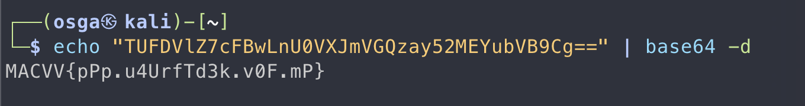

然後在凱薩，超級送分題w

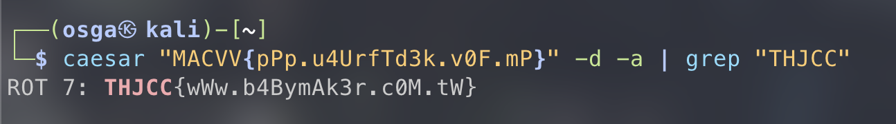

## Misc
### 出題者大合照！
- tag: `easy`、`Steganography`
>好誒!這是我們在 SITCON 2024 的大合照!
> 
> 感謝每一位辛苦的出題者 才有這次的比賽!
> 
> 但是但是 可惡的駭客 潘志豪 把FLAG給藏在這張照片了
> 
> 你能找到它嗎?
> 
> `Author : 0sGa`

下載完照片你會發現有一張史詩級帥氣的大佬們和一個小丑(我)的合照

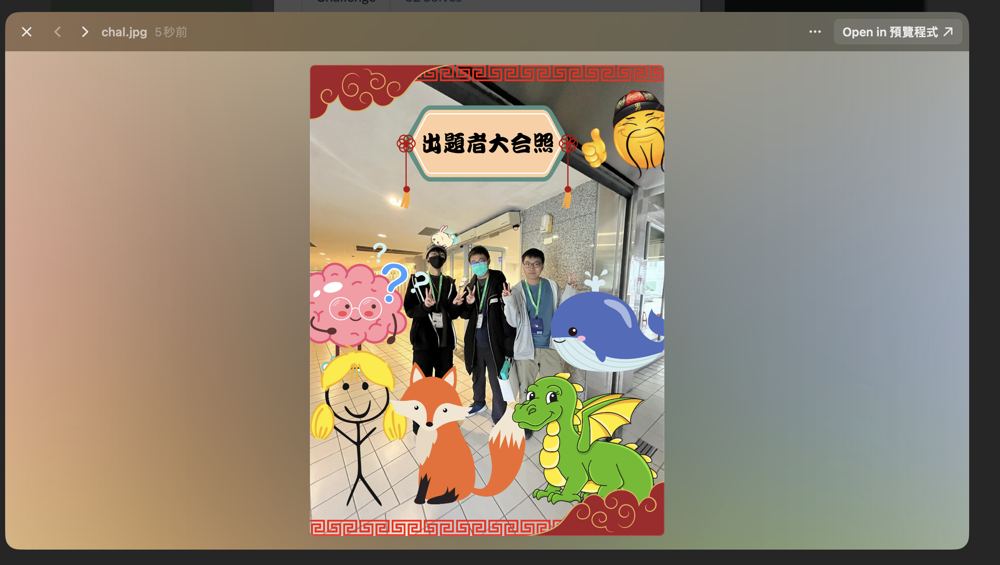

使用 `steghide info <file>` 可以看到照片內藏了怪東東

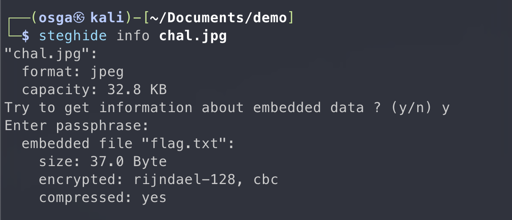

`flag.txt` 🤔 ，把它提出來看看
> 喔對，沒有設密碼，所以可以直按 enter

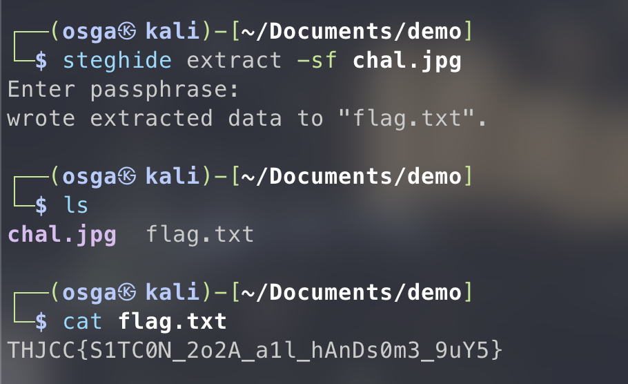

## 結語
好誒，撒花，終於落幕了（~~剩結賽典禮~~）

感謝這次參與比賽的各個參賽者

希望各位在比賽中有邊享受到解題的樂趣又學習到技術！

希望可以順利辦第二屆！謝謝大家，最菜出題者這邊下台一鞠躬。